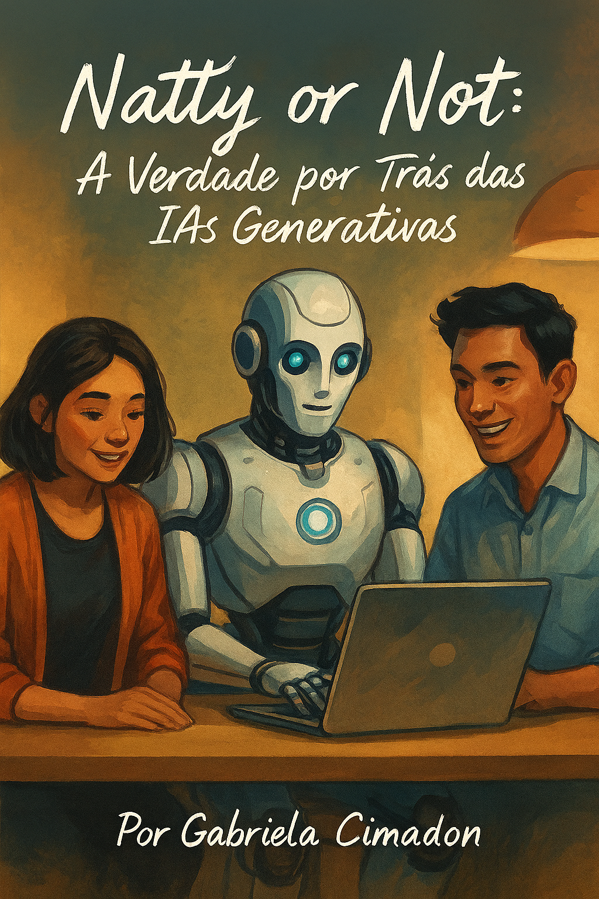

# 🤖 Natty or Not: A Verdade por Trás das IAs Generativas

📘 Clique na imagem acima para acessar o e-book completo!

---

## 📌 Sobre o Projeto
Este projeto foi criado como parte do desafio **DIO – Natty or Not**, com o objetivo de explorar e utilizar **IAs Generativas** para produzir conteúdos criativos e realistas.

O resultado é um e-book educativo explicando:
- O que são IAs Generativas
- Como funcionam
- Riscos e benefícios
- O que é Natty (natural) e o que não é 😉

---

## 🧠 Tecnologias e Ferramentas Utilizadas

| Tecnologia/Ferramenta | Função |
|----------------------|--------|
| ChatGPT              | Geração e organização dos textos |
| GitHub Copilot       | Apoio à escrita e revisão |
| Canva                | Design e diagramação do e-book |
| GitHub               | Versionamento e publicação do projeto |

---

## 🛠 Processo de Criação
1. Pesquisa do conteúdo
2. Escrita assistida com IA (ChatGPT + Copilot)
3. Criação visual no Canva
4. Montagem do e-book
5. Publicação no GitHub ✅

---

## 🎯 Resultados
📌 Entregável final deste projeto:  
📚 **E-book disponível para download:**  
👉 `docs/natty-or-not-GenAI.pdf`

Conteúdo com abordagem visual e acessível, trazendo informação e reflexão sobre o impacto da IA no mundo atual 🌍

---

## 💡 Reflexão
As IAs ampliam nossa produção,
mas **quem dá direção e propósito somos nós** 👩‍💻✨

**Humano + IA = Supercriador Natty 🚀**

---

## 👩‍💻 Autora
Projeto desenvolvido por **Gabriela Cimadon**  
para o **Lab Natty or Not – DIO**
